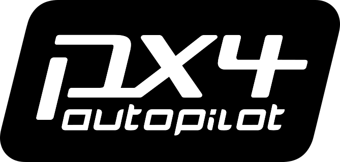
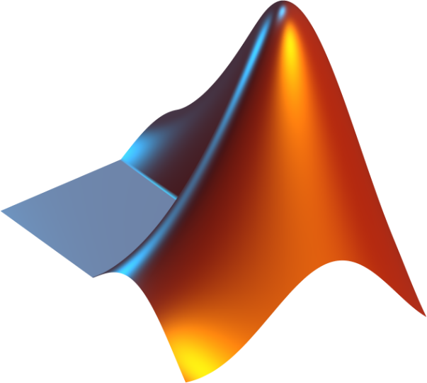
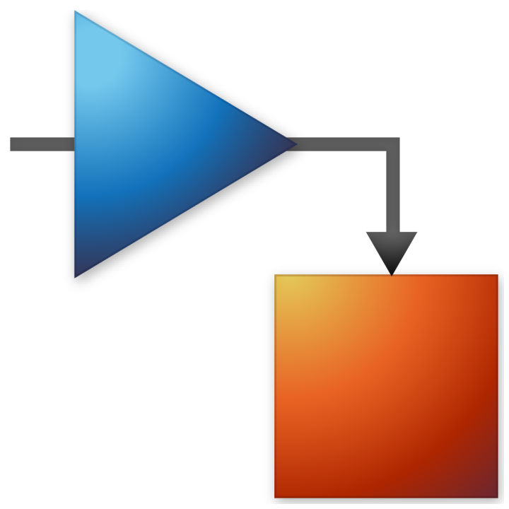
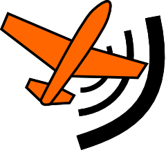

# 👋 GIPYO PARK 👋

**Mobility · Aerospace · Defense · Simulation & Verification**

---

## About Me

모빌리티·항공·방산 분야의 **제어 시스템, 시뮬레이션, 가상 환경 검증**에 관심이 있습니다.

특히 모델과 시뮬레이션에서 얻은 결과를 실제 시스템으로 연결하는 **Sim2Real**,  
그리고 **SIL/HIL(SILS/HILS) 기반 성능 평가와 검증 자동화**를 탐구하고 있습니다.

- Control system development and verification
- Simulation-based testing and virtual validation
- Software-in-the-Loop Simulation (SIL/SILS)
- Hardware-in-the-Loop Simulation (HIL/HILS)
- Sim2Real transfer and performance evaluation
- Reproducible engineering workflows

## Engineering Interests

`Mobility` `Aerospace` `Defense` `Autonomous Systems`  
`Simulation` `Sim2Real` `Control` `SIL/SILS` `HIL/HILS` `V&V`

## Technical Skills

### Languages

| C++ | Python |
| :---: | :---: |
|  |  |

### Engineering Platforms & Tools

| PX4 | MATLAB / Simulink | ROS |
| :---: | :---: | :---: |
|  |   |  |

| Gazebo | MAVLink | QGroundControl | Github |
| :---: | :---: | :---: | :---: |
|  |  |  |  |

### Development Environment

| Ubuntu | Linux |
| :---: | :---: |
|  |  |
